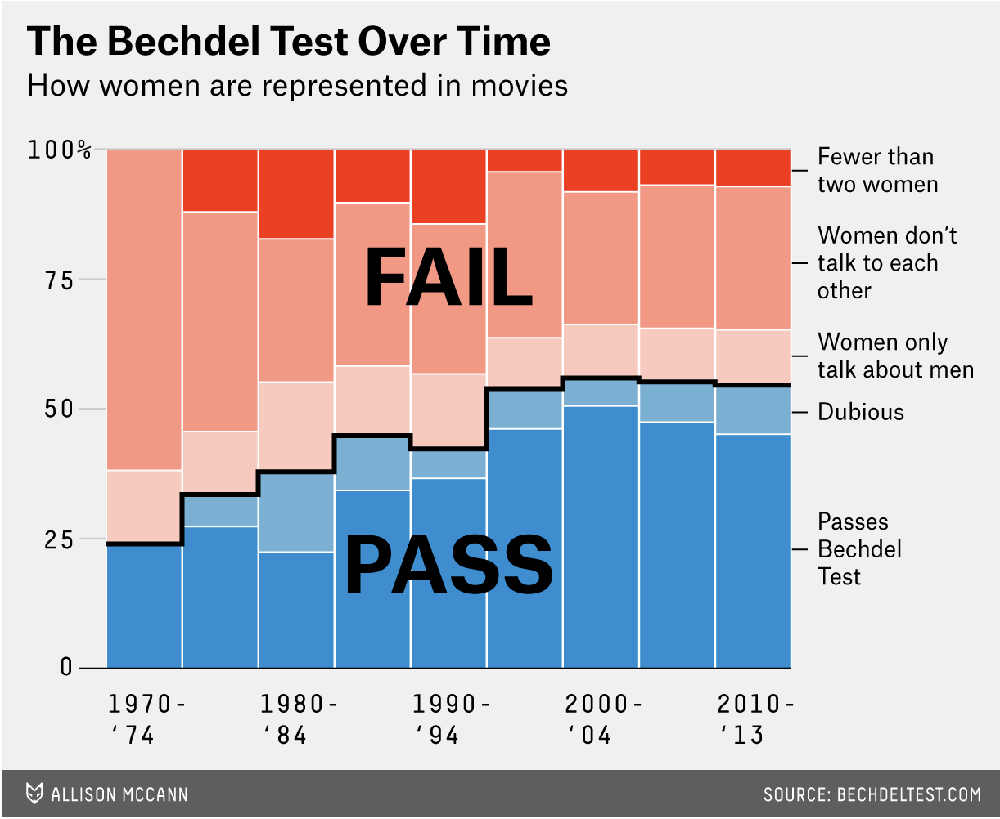

# Presentation Exercise - FiveThirtyEight - bechdel, The Dollar-And-Cents Case Against Hollywood’s Exclusion of Women

Sample of 1,794 films released between 1970 and 2013. Test originally promoted by cartoonist Alison Bechdel, to pass the test, a move must have: at least two named women in the picture, they have a conversation with each other at some point, and that conversation isn’t about a male character. 

```{r}
##Load necessary packages
library(ggplot2)
library(dplyr)
library(tidyverse)
library(readr)
library(flextable)
library(officer)
```

The data was in a github repository, so I downloaded it and started there, and I took a picture of the original graph to compare. 
The first thing I did was put the picture into ChatGPT, with the prompt "can you tell me what r program was used to make this graph:" (because I've only ever used ggplot, and wanted to make sure I didn't need to use lattice or anything new to do this assignment). 


It told me: 

"This was almost certainly made in R using the ggplot2 package.

Here’s why:

It’s a stacked area chart (100% stacked proportions over time), which is commonly created in ggplot2 with geom_area(position = "fill").

The clean typography, legend styling, and minimal theme are very characteristic of ggplot2.

The stepped black outline between “PASS” and “FAIL” groups could be done with an additional geom_line() layer.

The overall aesthetic strongly resembles graphics produced for data journalism using ggplot2 (e.g., FiveThirtyEight-style visuals)."

So, then I started to play around with the dataset that it came from. 

```{r}
##Read dataset into R 
bechdel <- read_csv("movies.csv")

##Make some changes to the dataset to make it easier to make the graph
#Dataset has a data in years, but the graph has data in groups of 5 years, so I have to make a column for that 
bechdel <- bechdel %>% mutate(period = cut(year, breaks = c(1970, 1975, 1980, 1985, 1990, 1995, 2000, 2005, 2010, 2014), right = FALSE, labels = c("1970-'74", "1975-'79", "1980-'84", "1985-'89", "1990-'94", "1995-'99", "2000-'04", "2005-'09", "2010-'13")))

#On the right side, I want to make sure to include the labels for each group, but they don't look in the table the way they do on the graph, also making sure than they are sorted so that passing is on the bottom and failing is on the top. 
bechdel <- bechdel %>% mutate(clean_test = recode(clean_test, "notalk" = "Women don't talk to each other", "ok" = "Passes Bechdel Test", "men" = "Women only talk about men", "nowomen" = "Fewer than two women", "dubious" = "Dubious"), clean_test = factor(clean_test, levels = c("Fewer than two women", "Women don't talk to each other", "Women only talk about men", "Dubious", "Passes Bechdel Test")))

#The graph has percentages on the y axis, which I assume is number of movies total, so each bar is divided into groups of number of movies in that group divided by the total number of movies, also made it into a smaller, easier to read graph
bechdel_small <- bechdel %>% group_by(period, binary, clean_test) %>% 
  summarise(n = n(), .groups = "drop") %>% 
  group_by(period) %>% 
  mutate(percent = n/sum(n)) %>% 
  arrange(period, clean_test) %>% 
  mutate(cum_percent = 1 - cumsum(percent)) 
```

So other than the stacked bar graph, which I already knew how to make generally, there is also as step-wise looking line separating the pass and fail groups, which I didn't know how to make. After arguing with ChatGPT on whether it was a line or a step or whether the original graph had bars or not, it told me I would need to use geom_segment to add that aspect to the figure and would need to make sure my x-axis was continuous and not discrete, so then I made another dataframe to accomplish this.

```{r}
##This part is to create the cumulative percent column to add up the percents of the different types for that period
bechdel_small <- bechdel_small %>% arrange(period, clean_test) %>% mutate(cum_percent = 1 - cumsum(percent))

##Making the x column so that I will be plotting continuous, not discrete values
bechdel_small <- bechdel_small %>% mutate(x = as.numeric(period))

##New dataframe to have the line information and so that the "line" will go between "Women only talk about men" and "Dubious" on the figure
line <- bechdel_small %>% 
  filter(clean_test == "Women only talk about men") %>%
  arrange(x) %>%
  ungroup() %>%
  mutate(x = as.numeric(period), xmin = x - 0.49, xmax = x + 0.49, next_y = lead(cum_percent))
```

Now I started to try to do the graph recreating part of the assignment. 

I also then asked ChatGPT to tell me the colors, theme (theme information was taken directly from ChatGPT as it said it was not a typical theme_minimal), and font size/boldness involved in the graph, so that I could match it. ChatGPT said the original graph style was very newsroom (?), and suggested to use the Helvetica font 

```{r}
##Now try to graph
ggplot(bechdel_small, aes(x = x, y = percent, fill = clean_test, group = clean_test)) + 
    geom_bar(position = "stack", stat = "identity", width = 0.98, colour = "white") +
    scale_fill_manual(values = c("Passes Bechdel Test" = "#1C7FB6", "Dubious" = "#8EC1DA", "Women only talk about men" = "#E9B7A8", "Women don't talk to each other" = "#F07A63", "Fewer than two women" = "#F23B1F")) + 
    scale_x_continuous(breaks = unique(bechdel_small$x)[seq(1, length(unique(bechdel_small$x)), by = 2)], labels = levels(bechdel_small$period)[seq(1, length(levels(bechdel_small$period)), by = 2)]) +
    scale_y_continuous(labels = scales::percent) +
    labs(title = "The Bechdel Test Over Time", subtitle = "How women are represented in movies", x = NULL, y = NULL, fill = NULL) + 
    annotate("text", x = 5, y = 0.25, label = "PASS", size = 12, fontface = "bold") + 
    annotate("text", x = 5, y = 0.75, label = "FAIL", size = 12, fontface = "bold") + 
    theme_minimal(base_family = "Helvetica") + 
    theme(panel.grid.major.x = element_blank(), panel.grid.minor = element_blank(), panel.grid.major.y = element_blank(), plot.title = element_text(face = "bold", size = 30, color = "#222222"), plot.subtitle = element_text(size = 18, color = "#555555"), axis.text = element_text(size = 12, color = "#444444"), legend.text = element_text(size = 13), legend.position = "right") +
    geom_segment(data = line, aes(x = xmin, xend = xmax, y = cum_percent, yend = cum_percent), inherit.aes = FALSE, color = "black", linewidth = 1.2, lineend = "round", linejoin = "round") + 
    geom_segment(data = line, aes(x = xmax, xend = xmax, y = cum_percent, yend = next_y), inherit.aes = FALSE, color = "black", linewidth = 1.2, na.rm = TRUE, lineend = "round", linejoin = "round")
```

Okay, so not perfect, but pretty damn close. The only thing I don't know how to do is change the way the key shows up on the graph, otherwise I feel pretty good about how well I was able to get it to match. 

Here was the original: 
```{r}

```

Now for the table part. I think given this data, it should be a fairly basic table, the way that I think is easiest to follow is to make it wider so that there is fewer searching around for the information we want than in the original datframe. 

```{r}
#Starting off with defining the periods, to be used later
period_levels <- c("1970-'74", "1975-'79", "1980-'84", "1985-'89", "1990-'94", "1995-'99", "2000-'04", "2005-'09", "2010-'13")

#Get the total number per period
period_totals <- bechdel_small %>% group_by(period) %>% summarise(period_total = sum(n, na.rm = TRUE), .groups = "drop")

#Get the total number of movies included
overall_total <- sum(period_totals$period_total, na.rm = TRUE) 

#Make a wider plot and clean it up to only what I wanted in the table
bechdel_wide <- bechdel_small %>% group_by(clean_test, period) %>% 
  summarise(n = sum(n, na.rm = TRUE), .groups = "drop") %>% 
  complete(clean_test, period, fill = list(n = 0)) %>% 
  pivot_wider(names_from = period, values_from = n)

#Add a column with the sums for each row/Bechdel result and a percent of them 
new_bechdel <- bechdel_wide %>% mutate(Total = rowSums(across(all_of(period_levels)), na.rm = TRUE),`Percent of all films` = (Total / overall_total)*100)

#Make a one row data frame containing the totals for each period/column
total_row <- tibble(clean_test = "Total", !!!setNames(as.list(as.numeric(period_totals$period_total)), period_levels), Total = overall_total, `Percent of all films` = 100)

#Bind together two data frames
bechdel_final<- bind_rows(new_bechdel, total_row)

#Rename the column with the results to be more professional
bechdel_final <- rename(bechdel_final, `Bechdel Result` = clean_test)

#Had to google how to use flextable, googl said you have to use the flextable() function to create an empty table first
table_final <- flextable(bechdel_final)

#I used Google to tell me what aspects of the chart I needed to include and I asked ChatGPT to give me information about how to make it a newsroom-like theme
table_final <- table_final %>% add_header_row(values = c(" ", "Applying the Bechdel Test by Release Period", " "), colwidths = c(1, length(period_levels), 2)) %>% 
  theme_vanilla() %>% 
  bold(part = "header") %>% 
  align(align = "left", j = 1, part = "all") %>% 
  align(align = "right", j = 2:ncol(bechdel_final), part = "body") %>% 
  align(align = "center", part = "header") %>% 
  colformat_num(j = period_levels, big.mark = ",") %>% 
  colformat_num(j = "Total", big.mark = ",") %>% 
  width(j = 1, width = 2.6) %>% 
  width(j = period_levels, width = 0.95) %>% 
  width(j = c("Total", "Percent of all films"), width = 1.1) %>% 
  fontsize(size = 10, part = "all") %>% 
  autofit() %>% 
  bg(i = seq(1, nrow(bechdel_final), by = 2), bg = "#F5F5F5", part = "body") %>% 
  hline_top(border = fp_border(width = 1), part = "all") %>% 
  hline_bottom(border = fp_border(width = 1), part = "all") %>% 
  vline(border = fp_border(width = 0.5), part = "all") %>% footnote(i = 1, j = 1, part = "header", value = as_paragraph("Counts are number of films in each category by period. ", "Percent of all films is the row total divided by the grand total x 100."))

table_final

```

Looking at it, I don't think it's perfect, but given the data I chose, I think this was the format that was easiest to follow.